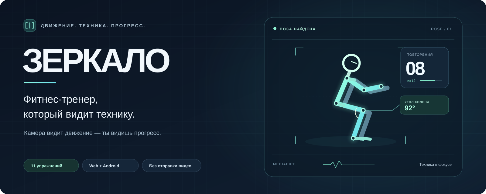
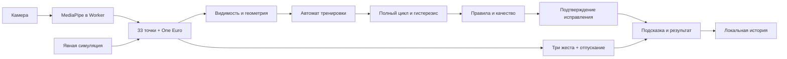

<p align="center"></p>

# Зеркало · MOTION

**Камера вместо джойстика: выбери тренировку телом, выполни движение, получи конкретную подсказку и увидь подтверждение исправления.**

Проект для **ADMIT HACKATHON**, кейс **«MOTION: камера вместо джойстика»**, направление — интерактивная тренировка с режимом «ошибка».

**Команда:** `[УКАЖИТЕ ТОЧНОЕ НАЗВАНИЕ КОМАНДЫ]`

**Репозиторий:** [ovverage/zerkalo](https://github.com/ovverage/zerkalo) — сейчас приватный. Для проверки жюри потребуется открыть доступ.

**Публичная веб-версия:** пока не опубликована. Рабочую HTTPS-ссылку нужно добавить после разрешённого владельцем размещения.

**Локальная сборка:** [localhost:4173/app/](http://localhost:4173/app/).

[Запуск](#быстрый-запуск) · [Управление](#движение--действие--обратная-связь) · [Режим ошибки](#режим-ошибка-и-исправление) · [Архитектура](docs/architecture.md) · [Проверки](docs/verification.md) · [Сценарий видео](docs/demo-script.md)

## Что показать жюри

1. Разрешить камеру и пройти три коротких урока управления.
2. Выбрать **«Три движения · MOTION»**: три приседа, три jumping jacks, три жима без веса. Все снимаются одной камерой спереди, примерно на высоте таза; человек целиком и поднятые кисти должны помещаться в кадр.
3. Показать полный цикл, визуальную реакцию на неполную амплитуду, конкретную подсказку и подтверждение следующего корректного повтора.
4. Руками поставить паузу, открыть помощь, вернуться и закончить тренировку.
5. Открыть результат; повторить попытку или выбрать **«Зеркало: исправь движение»** на 75 секунд.

Приложение не требует регистрации, установки, датчиков или сервера. Кадры обрабатываются на устройстве. Стоять по центру не требуется; нужны видимые рабочие суставы. Точность на живых людях пока **не подтверждена** — протокол такой проверки подготовлен отдельно.

## Быстрый запуск

Нужны **Node.js 22+**, npm, современный браузер с WebAssembly и камера. Ключи API, `.env` и база данных не нужны. Пока репозиторий приватный, GitHub должен разрешать вам клонирование.

```bash
git clone https://github.com/ovverage/zerkalo.git
cd zerkalo
npm ci
npm run dev
```

Открыть [localhost:5173](http://localhost:5173). Для просмотра production-сборки:

```bash
npm run build
npm run preview
```

Лендинг — [localhost:4173](http://localhost:4173/), приложение — [localhost:4173/app/](http://localhost:4173/app/).

`npm ci` устанавливает зависимости по lock-файлу и автоматически готовит локальные ресурсы: шесть файлов WASM/JS из MediaPipe и три модели из официального хранилища Google (около 44 МиБ). Размеры и SHA-256 зафиксированы в [`scripts/models.json`](scripts/models.json). При обрыве сети повторите `npm run prepare:assets`. Готовые файлы проверяются и используются повторно; во время тренировки сторонний CDN не нужен.

- **Включить камеру** — настоящий MediaPipe, запрос разрешения и обучение жестам.
- **Демо · симуляция без камеры** — искусственные координаты, автоматически показывающие три движения, ошибку, исправление и итог. Управление в этом режиме — кнопками. На всех экранах стоит явная маркировка; демонстрационные результаты не попадают в личную историю.
- **Упражнения и видеопоказы** — библиотека без обязательного включения камеры.

## Движение → действие → обратная связь

| Движение пользователя | Действие приложения | Видимая обратная связь |
| --- | --- | --- |
| Одна кисть над уровнем таза, направленная к кнопке, удержание 1,1 с | Выбор программы, помощь, настройки; кнопки «Выше» / «Ниже» прокручивают экран | Курсор, кольцо и полоса удержания, подтверждение выбора |
| Обе кисти выше головы, удержание 0,75 с | Подтверждение, старт из видеопоказа, продолжение с паузы | Полоса жеста и подтверждение команды |
| Руки крестом на груди, удержание 0,65 с | Пауза; возврат из видеопоказа; закрытие помощи | Панель паузы или возврат на предыдущий экран |
| Полный присед и возврат в стойку | +1 в счётчик приседаний | Амплитуда, угол колена, вспышка счётчика |
| Одновременное разведение стоп и подъём рук с возвратом | +1 jumping jack | Проверка рук, ширины и совпадения движений |
| Жим без веса: согнутые локти → кисти вверх → локти к плечам | +1 жим | Проверка разгибания обоих локтей и полного возврата |

После каждой команды **опустите руки**, прежде чем вводить следующую. Удержание не повторяется при смене экрана, смене цели или временной потере позы. Курсор привязан к плечам и размеру корпуса: доступны края экрана даже при смещении человека или на вертикальном телефоне.

Во время подготовки, отсчёта и выполнения выбор кнопок кистью отключён, а поднятые руки не запускают новую тренировку. Для помощи сначала скрестите руки, затем выберите «Как выполнять». В помощи работают и кисть, и закрытие жестом. В упражнениях на полу для паузы **безопасно встаньте лицом к камере**, затем скрестите руки; незавершённый повтор будет сброшен. Касание и мышь также поддерживаются.

## Режим «ошибка» и исправление

Различаем три ситуации:

| Ситуация | Что происходит | Пример реакции |
| --- | --- | --- |
| Блокирующее нарушение | Попытка сохраняется, счётчик не растёт | «Присед не зачтён: колено согнулось до 125°, нужно до 102°» |
| Замечание | Полный повтор засчитывается, качество снижается | «Выровняй плечи над тазом» при боковом наклоне в жиме; слишком быстрый темп |
| Не хватает надёжных данных | Измерение приостанавливается; не делаем вывод о технике | «Не удаётся отследить кисти» или «Повернись лицом к камере» |

Правила анализируют завершённый цикл, а устойчивые покадровые нарушения подтверждаются после задержки. В джампах раздельный мах руками и шаг не заменяют синхронное движение; подъём прямых рук не считается жимом.

**Подтверждение исправления основано на следующем зачтённом повторе.** Например, после недостаточной глубины: «Теперь достаточно глубоко — повтор засчитан». Зелёная подсказка не появляется просто от исчезновения человека из кадра. Счёт исправлений охватывает семь явно проверяемых правил амплитуды/синхронности трёх основных упражнений; это число разных исправленных правил, а не число всех подсказок.

Голос произносит только важные ошибки, не чаще раза в **10 секунд**. Одна ошибка — не чаще раза в **30 секунд**, даже если изменились числа. Предупреждения остаются визуальными. Очереди фраз нет, голос можно отключить.

### «Зеркало: исправь движение» · 75 секунд

Обычные приседания в удобном темпе. Не нужно намеренно нарушать технику. Приложение показывает одну актуальную подсказку и распознаёт измеримое исправление. Если нарушений не было, результат сообщает об успешных движениях без выдуманных ошибок.

Таймер идёт в состоянии выполнения независимо от частоты кадров; подготовка, помощь и пауза не расходуют 75 секунд. Сворачивание вкладки ставит тренировку на паузу, продолжение — только по команде пользователя. При потере видимости суставов время продолжается, а повторы не считаются. Итог сохраняется локально: повторы, качество, исправленные правила; на экране сравнивается предыдущая попытка. История хранит последние 60 тренировок. В симуляции сохранение отключено.

**Качество** — среднее по завершённым попыткам: `max(0, 100 − 20 × ошибки − 9 × замечания)`. Показатель описывает совпадение с правилами приложения, **не является медицинской оценкой**. Общий балл — 60% качества и 40% выполнения плана (в коротком режиме — по времени, при наличии зачтённых повторов). При отсутствии завершённых попыток вывод о технике не делается.

## Упражнения и видеопоказы

11 упражнений, 7 программ, включая MOTION и режим на 75 секунд. Перед стартом есть локальный беззвучный видеопоказ, исходная поза, ракурс, список необходимых суставов и текущая готовность камеры. Видео следующего движения также показывается во время отдыха.

| Упражнение | Ракурс | Основная проверка |
| --- | --- | --- |
| Приседания | Спереди, сбоку или под углом | Глубина, возврат, видимое сведение колен |
| Jumping jacks | Спереди | Руки, ширина шага, синхронность |
| Жим без веса | Спереди | Разгибание и возврат локтей, кисти над головой |
| Разведение рук | Спереди | Высота подъёма |
| Выпады | Спереди / по диагонали | Переднее колено и чередование |
| Подъём колен | Спереди | Высота и чередование |
| Наклоны в сторону | Спереди | Боковой наклон |
| Колено к локтю | Спереди | Противоположные локоть и колено |
| Присед с руками вверху | Спереди | Глубина и положение рук |
| Отжимания | Сбоку / по диагонали, камера невысоко | Упор лёжа, сгиб локтя, линия корпуса |
| Планка | Сбоку / по диагонали | Время правильной позы |

Для приседа, отжиманий и планки достаточно одной **целой** видимой стороны; оценка симметрии при этом недоступна. Камера строго сверху часто скрывает нужные сгибы — этот ракурс не обещается. Если кисти или стопы уходят за кадр, увеличьте расстояние. Три приоритетных упражнения имеют расширенные регрессионные проверки; остальные не заявляются столь же проверенными.

## Техническое устройство и собственная логика

Стек: строгий **TypeScript**, **Vite 6**, **MediaPipe Tasks Vision 0.10.35**, Canvas 2D, Web Worker, Web Speech / Web Audio, **Capacitor 8** для дополнительной Android-оболочки. UI-фреймворка и backend нет.



MediaPipe — сторонняя модель позы. **Она не считает наши упражнения и не выносит наши оценки техники.** Собственная логика проекта поверх её координат:

- проверка видимости рабочих цепочек и выбор пригодной стороны;
- геометрические метрики, калибровка, адаптивное сглаживание;
- автомат повторения с гистерезисом и фильтрацией одиночных выбросов;
- правила амплитуды, синхронности, возврата; приоритеты и задержка подсказок;
- пауза, потеря позы и защита от склеивания незавершённых движений;
- жесты, отпускание после команды, прокрутка и доступность модальной помощи;
- измеримое подтверждение исправления, оценка и сравнение попыток;
- раздельное измерение скорости модели и интерфейса.

Heavy используется по умолчанию. Full и Lite доступны в меню. Панель показывает **новые результаты модели в секунду** отдельно от кадров интерфейса. После прогрева, если модель устойчиво выдаёт менее 10 результатов/с, предлагается Lite; во время движения переключение доступно через паузу. Модель загружается с ограничением ожидания, зависший Worker приводит к понятной ошибке. Одновременно обрабатывается один кадр, старые результаты отбрасываются.

Подробности и точки расширения — [архитектура](docs/architecture.md).

```text
src/app.ts       источник, кадры, навигация
src/vision/      MediaPipe, Worker, измерения, достоверность, скорость
src/engine/      сессия, фазы, правила, исправления
src/gestures/    удержание, отпускание, курсор
src/exercises/   описания 11 упражнений и видеогидов
src/demo/        отдельно обозначенные синтетические координаты
src/ui/          экраны, помощь, подсказки, звук
src/storage/     история и настройки
public/          модели, WASM, 11 MP4 и постеры
scripts/         подготовка ресурсов, сборки и проверка публикации
test/            unit-тесты и браузерные стенды
docs/            архитектура, доказательства, протокол и сценарий видео
```

## Проверки и ограничения

```bash
npm run typecheck
npm test
npm run build
npm run verify:release
```

Фактически проведённые проверки, версии, границы выводов и протокол для владельца — в **[docs/verification.md](docs/verification.md)**. Синтетические координаты, изображение, видео и живая камера перечислены отдельно. Тесты не означают подтверждённую точность на людях.

Браузерные стенды доступны только у dev-сервера:

- `/test/handsfree.html` — реальные экраны и движок жестов, автоматический полный маршрут с синтетическими координатами. Не обращается к камере и не сохраняет тренировки.
- `/test/browser.html` — настоящая Heavy-модель на эталонном изображении, смещение и поворот.
- `/test/guidance.html` — экраны инструкций на белом фоне.

Ограничения: один человек, одна камера, неоднозначность 3D-оценки и перекрытий; пороги требуют проверки на разных людях. Режим жима не оценивает изгиб поясницы по фронтальной камере. Нет клинической валидации, Service Worker и гарантии офлайн-работы веб-сайта. Речь зависит от голосов ОС. На браузерах без Worker/OffscreenCanvas используется основной поток; скорость нужно проверить на целевом телефоне. Нет синхронизации истории между устройствами.

## Размещение по HTTPS

```bash
npm ci
npm run build
npm run verify:release
```

Загружать на статический HTTPS-хостинг **только содержимое `dist/`**. Стартовая страница находится в корне, приложение — в `app/`. `base: './'` позволяет размещать сайт и в подпапке. Модели, WASM, шрифты и видеопоказы входят в сборку; сервер API не нужен. Камера работает по HTTPS или на localhost, но не через обычный HTTP-адрес телефона в локальной сети.

`verify:release` проверяет модели по SHA-256, runtime, медиаматериалы, ссылки ресурсов и отсутствие исходников, тестов и локальных секретов. Для ZIP нужна системная утилита `zip` (самому хостингу достаточно каталога `dist/`). Готовый архив формируется командой `npm run package:web` в `release/zerkalo-web.zip`. CI проверяет сборку, но **ничего не публикует**. Изменение приватности репозитория и публичное размещение требуют отдельного решения владельца.

Для GitHub Pages подготовлен **неактивный** [шаблон публикации](docs/pages-workflow.yml.example), по [официальной инструкции GitHub](https://docs.github.com/en/pages/getting-started-with-github-pages/using-custom-workflows-with-github-pages). После разрешения владельца: перенести его в `.github/workflows/pages.yml`, включить источник Pages «GitHub Actions» и запустить вручную на `main`. Он повторяет проверки и загружает только `dist/`; обычный push сайт не публикует. До успешного размещения публичная ссылка не заявляется.

## Android (дополнительно)

Основная сдача — браузер. Для Android нужны JDK 21, Android SDK API 36 и Node.js 22+:

```bash
npm run android:apk
```

Скрипт учитывает `JAVA_HOME` / `ANDROID_HOME` и ищет локальный toolchain. Результат — `dist/zerkalo.apk`, debug APK для проверки, не релиз магазина. Android 7.0+ и современный WebView; модели и ролики включаются внутрь. Сборка сайта сама не добавляет старый APK; актуальный APK можно приложить явно после его пересборки.

## Решение проблем

| Проблема | Действие |
| --- | --- |
| Нет доступа к камере | Разрешить её в браузере, проверить HTTPS и повторить запуск |
| Камера занята | Закрыть другое приложение, использующее её |
| Поза не найдена | Показать перечисленные суставы, улучшить освещение, выбрать нужный ракурс; центр не обязателен |
| Повтор не засчитан | Прочитать причину; вернуть исходную позу и выполнить полный цикл |
| Повторный жест не срабатывает | Опустить руки на короткое время; затем выполнить новую команду |
| Кнопка ниже экрана | Кистью выбрать «Ниже», опустить руку и продолжить прокрутку |
| Низкая скорость | Сравнить частоту модели с частотой экрана; выбрать Lite в меню или по предложению |
| Ресурсы не скачались при установке | Проверить сеть, повторить `npm run prepare:assets` |
| Нет голоса | Проверить голос ОС, настройку приложения и разрешение звука; текст работает независимо |

## Материалы и происхождение

[THIRD_PARTY_NOTICES.md](THIRD_PARTY_NOTICES.md) содержит источники MediaPipe, моделей Google, шрифта Inter, Capacitor и тестовой фотографии. Беззвучные MP4 — собственные векторные анимации, созданные [`scripts/build-exercise-videos.py`](scripts/build-exercise-videos.py); это инструкции, а не записи реального распознавания. Баннер — [PNG](docs/assets/banner.png) и редактируемый [SVG](docs/assets/banner.svg).

Проект до этой доработки уже содержал 11 упражнений, Android-оболочку, анимации, базовый движок и тестовые заготовки. Текущая версия развивает эту основу. История Git сохранена; даты и происхождение разработки не переопределяются. Собственный UI и правила отделены от сторонней модели; условия использования сторонних компонентов приведены в уведомлениях.
