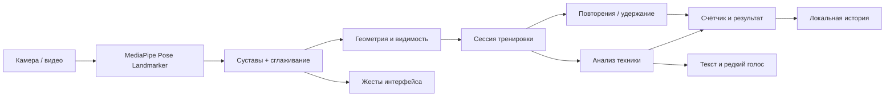

<p align="center">
  
</p>

# Зеркало

**Фитнес-тренер в браузере и на Android: считает движения через камеру, объясняет упражнения и помогает заметить ошибки техники.**

Зеркало распознаёт позу на устройстве, оценивает амплитуду и показывает, что поправить. Для тренировки не нужны датчики, аккаунт или сервер. Можно находиться в любой части кадра — важна видимость суставов, участвующих в упражнении.

[Запуск](#быстрый-запуск) · [Как тренироваться](#как-тренироваться) · [Упражнения](#упражнения) · [Устройство](#техническое-устройство) · [Android](#android) · [Проверки](#проверки) · [Решение проблем](#решение-проблем)

## Возможности

| | Что делает приложение |
| --- | --- |
| **11 упражнений** | Приседания, отжимания, планка, выпады, упражнения на корпус и кардио. Отдельные подходы и 5 готовых программ. |
| **Видеопоказы** | Короткие беззвучные анимации: исходная поза, движение и возврат. Для каждого упражнения — рекомендации по ракурсу камеры. |
| **Подсчёт и техника** | Полные повторения, незачтённые попытки с объяснением, подсветка суставов и индикатор амплитуды. |
| **Спокойный голос** | Важные ошибки — с интервалом не менее 10 секунд; повтор одной ошибки — не чаще раза в 30 секунд. Без очереди фраз и перебивания. |
| **Управление жестами** | Выбор кнопки удержанием кисти, подтверждение поднятыми руками, пауза. Кнопки мышью и касанием доступны всегда. |
| **Локальный прогресс** | История последних 60 тренировок, рекорды и серия дней в локальном хранилище. |
| **Web + Android** | Один интерфейс и движок. Модели, видеопоказы, шрифт и WASM входят в сборку. |

## Быстрый запуск

Нужны **Node.js 22 или новее**, npm и браузер с поддержкой WebAssembly и камеры. Node.js 22 также нужен CLI Capacitor для сборки Android. Ключи API, `.env` и база данных не требуются.

```bash
git clone https://github.com/ovverage/zerkalo.git
cd zerkalo
npm ci
npm run dev
```

Откройте **[localhost:5173](http://localhost:5173)**. Репозиторий приватный: для клонирования нужен доступ к нему через GitHub.

- **«Включить камеру»** запускает распознавание и запрос разрешения камеры.
- **«Упражнения и видеопоказы»** позволяет сначала изучить упражнения без доступа к камере.
- **«Демо без камеры»** требует собственного файла `public/demo/demo.mp4`. Такая запись **не включена** в репозиторий; это отдельный режим, не библиотека анимированных видеопоказов. [Требования к ролику →](public/demo/README.md)

При `npm ci` скрипт `postinstall` копирует WASM из установленного MediaPipe и скачивает три модели из официального хранилища Google (около 44 МиБ). Размеры и SHA-256 зафиксированы в [`scripts/models.json`](scripts/models.json); уже подготовленные файлы проверяются и используются повторно. Если загрузка прервалась, выполните `npm run prepare:assets`. Скачивание нужно при подготовке проекта, а не во время тренировки.

Модель **Heavy** выбрана по умолчанию. Она занимает около 30 МБ; первый запуск может быть заметно дольше последующих. В настройках есть **Full** и **Lite** для устройств, которым тяжело обрабатывать Heavy.

## Как тренироваться

1. **Выберите упражнение или программу.** Перед стартом откроется видеопоказ; в программе можно посмотреть каждое движение.
2. **Подготовьте камеру.** Следуйте карточке «Куда поставить камеру»: там указаны ракурс, высота и необходимые суставы.
3. **Нажмите «Начать».** Приложение дождётся видимости рабочих суставов и запустит отсчёт. Стоять строго в центре не нужно.
4. **Выполняйте движение и возвращайтесь в исходную позу.** Повторение завершается после полного цикла. При недостаточной амплитуде приложение показывает причину незачёта.
5. **Откройте «Как выполнять», если нужна помощь.** Тренировка встанет на паузу. Кнопкой с динамиком можно сразу отключить голос.

Для приседаний, отжиманий и планки достаточно **одной полностью видимой стороны тела**. Для других упражнений могут понадобиться обе стороны — список приведён в инструкции каждого движения. Положение у края кадра разрешено, полностью скрытые или обрезанные рабочие суставы мешают измерениям.

Во время отдыха показывается видео следующего упражнения. После завершения доступны результат, ошибки и история. Карточки выбора имеют непрозрачный тёмный фон, поэтому читаются и при ярком изображении камеры.

### Жесты

| Жест | Действие |
| --- | --- |
| Удержать кисть на кнопке до заполнения кольца | Выбрать пункт меню или доступную кнопку |
| Поднять обе руки над головой | Подтвердить выбор / продолжить с паузы |
| Скрестить руки перед грудью | Пауза или возврат, в зависимости от экрана |

Во время выполнения и подготовки выбор кнопок удержанием кисти отключён, чтобы движение упражнения не стало случайным нажатием. Пропуск упражнения выполняется кнопкой; завершение требует повторного нажатия.

## Упражнения

Ракурс — рекомендация для видимости движения, а не требование стоять в определённой точке экрана.

| Упражнение | Рекомендуемый ракурс | Основная проверка |
| --- | --- | --- |
| Приседания | Спереди, сбоку или под углом | Сгибание колена, глубина, положение корпуса |
| Jumping jacks | Спереди | Подъём рук и разведение ног |
| Жим над головой | Спереди | Разгибание локтей и положение рук |
| Разведение рук | Спереди | Высота подъёма и раскачивание корпуса |
| Выпады | Спереди или по диагонали | Сгибание переднего колена и положение ног |
| Высокий подъём колен | Спереди | Высота колена, чередование сторон |
| Наклоны в сторону | Спереди | Боковой наклон и смещение таза |
| Колено к локтю | Спереди | Сближение противоположных локтя и колена |
| Присед с руками вверху | Спереди | Глубина приседа и удержание рук |
| Отжимания | Сбоку или по диагонали, камера невысоко | Упор лёжа, сгибание локтя, линия корпуса |
| Планка | Сбоку или по диагонали, камера невысоко | Удержание линии корпуса; время правильной позы |

Съёмка строго сверху обычно скрывает сгибание рук и линию корпуса в упражнениях на полу. Посмотрите пример перед началом и оставьте в кадре место для всего движения.

## Техническое устройство

**Стек:** TypeScript в строгом режиме, Vite 6, MediaPipe Tasks Vision `0.10.35`, Canvas 2D, Web Workers, Web Speech API, Web Audio API и Capacitor 8. Интерфейс написан без UI-фреймворка; серверной части нет.



- **Распознавание.** MediaPipe возвращает 33 точки позы. По возможности вычисления идут в Worker, одновременно обрабатывается один кадр. Повторный показ одного результата не увеличивает время планки.
- **Отслеживание.** Проверяются нужные упражнению цепочки суставов и их достоверность. Для упражнений с одной видимой стороной скрытая сторона не портит средний угол. При потере позы используется повторный поиск, в том числе на повёрнутом кадре.
- **Измерения.** Углы и относительные расстояния вычисляются по 3D-точкам и экранной проекции с учётом пропорций камеры. Координаты сглаживаются фильтром One Euro.
- **Подсчёт.** Автомат фаз с разными порогами входа и возврата защищает от дрожания сигнала. В упражнениях на полу отдельно проверяется исходная поза; движение руками стоя не считается отжиманием.
- **Техника.** Правила выполняются покадрово и по итогам повторения. Есть задержка подтверждения ошибки, приоритеты подсказок и разделение ошибок и предупреждений. Голос дополнительно ограничен общим интервалом.
- **Сессия.** Подготовка → отсчёт → выполнение → отдых → результат, с поддержкой паузы, пропуска и потери отслеживания.

Подробности, ключевые файлы и порядок добавления упражнений — в **[описании архитектуры](docs/architecture.md)**.

### Структура репозитория

```text
src/
  app.ts              источник видео, главный цикл, маршрутизация
  core/               базовые экраны, Android-навигация, Wake Lock
  vision/             модель позы, Worker, сглаживание, геометрия
  engine/             сессия, счётчик, удержание, анализ техники
  exercises/          11 описаний движений, программы, видеогиды
  gestures/           жесты и выбор кнопок удержанием кисти
  ui/                 экраны, скелет, видеоинструкции, голос, эффекты
  storage/            настройки и история в localStorage
  styles/             адаптивный интерфейс
public/
  models/             Heavy, Full и Lite (подготавливаются при установке)
  wasm/               рантайм из npm (подготавливается при установке)
  exercises/          11 MP4 и SVG-иллюстрации
  demo/               инструкция для необязательной видеозаписи
android/              оболочка Capacitor и Gradle wrapper
landing/              отдельная стартовая страница сайта
scripts/              сборка лендинга, APK и видеопоказов
test/                 автоматические тесты и браузерные стенды
docs/                 архитектура и исходник баннера
```

### Обработка данных

Код приложения не отправляет кадры камеры, точки тела или историю на сервер. Модели, WASM и шрифт загружаются из файлов приложения. История и настройки хранятся в `localStorage` конкретного браузера / WebView; очистка данных удалит их, синхронизации между устройствами нет.

Голос использует доступные голоса браузера или операционной системы, поэтому его наличие и работа без сети зависят от устройства. Распознавание, видеопоказы и основной интерфейс Android-приложения работают с локальными ресурсами. Веб-версия требует доступа к размещённым файлам; отдельный офлайн-кэш приложения / Service Worker не реализован.

## Команды

| Команда | Назначение |
| --- | --- |
| `npm ci` | Установить зависимости строго по lock-файлу |
| `npm run prepare:assets` | Подготовить WASM и проверить / скачать модели |
| `npm run dev` | Запустить Vite, по умолчанию порт 5173 |
| `npm run typecheck` | Проверить типы TypeScript |
| `npm test` | Запустить тесты движка, отслеживания, жестов, голоса и видеогидов |
| `npm run build` | Собрать приложение и лендинг в `dist/` |
| `npm run preview` | Открыть собранный сайт на порту 4173 |
| `npm run build:app` | Собрать только приложение в `dist/app/` |
| `npm run android` | Собрать веб-приложение и синхронизировать Capacitor |
| `npm run android:apk` | Собрать отладочный Android APK |
| `npm run android:open` | Открыть Android-проект в Android Studio |

## Веб-сборка и размещение

```bash
npm run build
npm run preview
```

- **Лендинг:** [localhost:4173](http://localhost:4173/).
- **Приложение:** [localhost:4173/app/](http://localhost:4173/app/).
- Для размещения на статическом хостинге используйте каталог **`dist/`**.
- Команда сборки для хостинга: **`npm ci && npm run build`**.
- Для камеры нужен **HTTPS** либо `localhost`. Открытие с телефона через обычный `http://192.168.…` не даёт доступ к камере.

`base: './'` в Vite позволяет использовать одни файлы по `/app/` на сайте и в корне Android WebView. Сборка лендинга добавляет ссылку на APK, только если APK уже существует в Android-проекте.

## Android

Понадобятся **Node.js 22+**, **JDK 21** и **Android SDK с платформой API 36** и инструментами сборки. Gradle wrapper входит в репозиторий. `scripts/build-apk.mjs` ищет JDK и SDK в стандартных каталогах и учитывает `JAVA_HOME` / `ANDROID_HOME`.

```bash
npm ci
npm run android:apk
```

Результат: **`dist/zerkalo.apk`**, также доступен в `android/app/build/outputs/apk/debug/app-debug.apk`.

Это **debug APK** для установки и проверки, не подписанная сборка для публикации в магазине. Минимальная версия ОС — Android 7.0 (API 24); нужен современный Android System WebView с WebAssembly SIMD и поддержкой камеры. Фактическая скорость зависит от устройства.

Порядок сборки: TypeScript → Vite → `cap sync android` → Gradle `assembleDebug`. Модели и видеопоказы включаются в APK. На тренировке приложение удерживает экран включённым, учитывает системные отступы и обрабатывает Android-кнопку «назад».

Чтобы собрать сайт вместе с актуальным APK:

```bash
npm run android:apk
npm run build
```

## Проверки

```bash
npm run typecheck
npm test
npm run build
```

В текущем наборе **56 автоматических тестов**. Они проверяют полный и неполный присед, отжимания в упоре, ложные повторы, скрытую сторону тела, положение у края, потерю кадра, паузу, жесты, смену модели, интервалы голоса и наличие видеогидов.

Распознавание проверяется на синтетических позах, а браузерный стенд — на эталонном изображении. Эти проверки **не являются измерением точности на выборке реальных тренировок**.

После `npm run dev` доступны два дополнительных стенда:

| Страница | Что проверить |
| --- | --- |
| `/test/browser.html` | Запуск настоящей Heavy-модели на тестовом изображении: центр, края, поворот. Доступ к камере не нужен. |
| `/test/guidance.html` | Карточки и видеопоказы на белом фоне, узкий экран, пауза при открытии помощи. |

Стенды и тестовое изображение не входят в веб-сборку и APK. Источник изображения указан в [test/fixtures/README.md](test/fixtures/README.md).

## Решение проблем

| Симптом | Что проверить |
| --- | --- |
| Камера не открывается | Разрешение камеры для сайта, HTTPS / localhost, не занята ли камера другим приложением. |
| Подготовка не заканчивается | Видны ли все суставы из карточки упражнения; достаточно ли света; не перекрывает ли одна конечность другую. |
| Отжимания не считаются | Принят ли упор лёжа; видны ли плечо, локоть, кисть, таз и колено одной стороны; лучше снимать сбоку или по диагонали. |
| Неполный повтор не засчитан | Посмотрите текст ошибки, индикатор амплитуды и видеопоказ. Повторение учитывается после возврата в исходную позу. |
| Видео камеры тормозит | Переключите модель с Heavy на Full или Lite в меню. Закройте другие приложения, использующие камеру / GPU. |
| Нет голоса | Включите его кнопкой динамика и проверьте русские голоса устройства. Текстовые подсказки работают отдельно. |
| Не работает «Демо без камеры» | Добавьте свою запись `public/demo/demo.mp4`. Анимированные обучающие ролики уже включены и работают независимо. |
| Android-сборка не запускается | Проверьте JDK 21, Android SDK API 36 и пути `JAVA_HOME` / `ANDROID_HOME`. |

## Ограничения

- Отслеживается **один человек**. Закрытые суставы и сильное укорочение проекции снижают качество измерений; «любое место в кадре» не означает «любой ракурс без видимых конечностей».
- Пороговые правила не откалиброваны на большой выборке людей. Оценка качества и калорий приблизительная; приложение не заменяет очную оценку техники.
- Heavy требует больше вычислений. Универсальная частота кадров для всех устройств не гарантируется.
- Видеопоказы — **оригинальные анимации**, а не записи тренера. Все 11 MP4 с иллюстрациями занимают около 613 КБ.

## Материалы и зависимости

- [MediaPipe Pose Landmarker](https://ai.google.dev/edge/mediapipe/solutions/vision/pose_landmarker) — модель позы и рантайм. Подготовка локальных файлов и их происхождение описаны в [public/models/README.md](public/models/README.md).
- [Capacitor](https://capacitorjs.com/) — Android-оболочка; [Inter](https://github.com/rsms/inter) через Fontsource — локальный шрифт.
- [Баннер PNG](docs/assets/banner.png) и [редактируемый SVG](docs/assets/banner.svg) входят в репозиторий.
- Анимации воспроизводимы: `python3 scripts/build-exercise-videos.py` (нужны `ffmpeg` и `rsvg-convert`). Для обычной сборки генератор не требуется.
- Лицензии и источники сторонних материалов: [THIRD_PARTY_NOTICES.md](THIRD_PARTY_NOTICES.md). Лицензия на собственный код проекта пока не выбрана.
