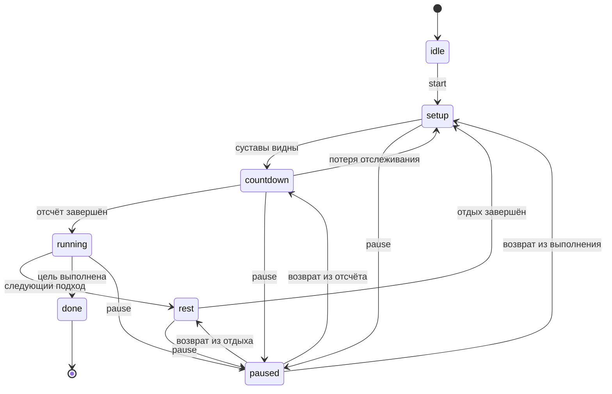

# Архитектура Зеркала

[← README](../README.md)

Приложение состоит из независимых слоёв: получение позы, измерения, правила упражнения, управление сессией и показ результата. Распознавание выполняет готовая модель MediaPipe; решение о зачёте повторения принимает собственный движок на TypeScript.

## 1. Главный цикл

[`src/app.ts`](../src/app.ts) создаёт источник видео, распознаватель, экраны, жесты и Canvas-слои. На каждом кадре:

1. `PoseDetector` получает новый кадр или возвращает актуальный готовый результат.
2. `GestureEngine` сопоставляет кисть с доступными кнопками и распознаёт жесты.
3. Текущий `Screen` обновляет свою логику. На тренировке он передаёт тело в `WorkoutSession`.
4. `SkeletonOverlay` рисует позу, подсветку ошибок, рамку человека. `HandsFreeControls` рисует курсор в DOM, в том числе внутри верхнего слоя диалога.
5. Обновляются эффекты и, при включении, индикатор FPS.

`Screen` зависит от интерфейса `AppApi`, а не от реализации `App`. Экраны задают разметку и таблицу `data-action`; удержание кисти превращается в обычный клик. У касания, мыши и жеста один обработчик.

Маршруты: `welcome`, `tutorial`, `menu`, `preview`, `workout`, `results`, `history`. Предпросмотр упражнения не запускает таймер тренировки.

## 2. Распознавание и отслеживание

| Файл | Ответственность |
| --- | --- |
| [`poseDetector.ts`](../src/vision/poseDetector.ts) | Координация Worker, ограничение до одного кадра в работе, отбрасывание устаревших результатов |
| [`pose.worker.ts`](../src/vision/pose.worker.ts) | Приём `ImageBitmap`, запуск движка и возврат точек |
| [`poseEngine.ts`](../src/vision/poseEngine.ts) | Загрузка модели, GPU / CPU, повторный поиск позы |
| [`tracking.ts`](../src/vision/tracking.ts) | Достоверность точек и целостность рабочих цепочек |
| [`rotation.ts`](../src/vision/rotation.ts) | Возврат координат из повёрнутого изображения в систему камеры |
| [`smoothing.ts`](../src/vision/smoothing.ts) | Адаптивное сглаживание One Euro |
| [`viewport.ts`](../src/vision/viewport.ts) | Единое преобразование координат видео и скелета |

Модель по умолчанию — **Heavy**; **Full** и **Lite** доступны в настройках. Версия `@mediapipe/tasks-vision` зафиксирована на `0.10.35`, соответствующий WASM копируется из установленного пакета в `public/wasm/` при `npm ci`. Сначала создаётся новый распознаватель, затем заменяется старый: неудачная смена модели не должна лишать пользователя работающей модели.

Worker используется при наличии `Worker`, `OffscreenCanvas` и `createImageBitmap`. В неподдерживаемом окружении `PoseEngine` выполняется в основном потоке. GPU используется при подходящих возможностях; при неудачной инициализации есть CPU-вариант. Ошибка уже запущенного Worker не равна автоматическому переключению на основной поток: интерфейс должен сообщить о проблеме запуска.

`Body` содержит 33 экранные и пространственные точки, показатели видимости, время и геометрию исходного кадра. Результат старше 300 мс не выдаётся как актуальный. Идентификатор поколения не позволяет принять ответ от кадра, отправленного до сброса распознавания.

### Видимость вместо требования центра

Рабочие суставы перечислены в `ExerciseSpec.required`. Режим `all` требует все указанные точки, `either-side` выбирает лучшую целую сторону. Порог достоверности — `0.45`; точки с нечисловыми координатами или за пределами кадра не считаются наблюдаемыми.

Для приседаний, отжиманий и планки важна одна целая цепочка, а не случайный набор точек с двух сторон. Смещение человека и небольшой размер сами по себе не блокируют старт. При этом модель не может надёжно измерить сустав, который полностью закрыт или обрезан.

## 3. Измерения

[`measurements.ts`](../src/vision/measurements.ts) и [`geometry.ts`](../src/vision/geometry.ts) преобразуют позу в именованные метрики: углы, наклоны, взаимные расстояния и относительные положения.

Расстояния нормируются относительно тела. При измерении углов учитываются пространственные точки и экранная проекция с поправкой на соотношение сторон видео; видимая сторона получает больший вес. Для некоторых движений используется автокалибровка исходного угла в допустимых пределах. Это уменьшает зависимость от ракурса, но не устраняет неоднозначность одной камеры.

## 4. Упражнение как описание

Контракт [`ExerciseSpec`](../src/engine/types.ts) объединяет:

- имя, группу мышц, режим `reps` / `hold` и текст инструкции;
- нужные суставы и режим проверки видимости;
- вычисление метрик и прогресса движения;
- пороги фаз и, при необходимости, проверку исходной позы;
- покадровые правила `liveRules` и правила завершённого повторения `repRules`;
- показатели для экрана и определение рабочей стороны.

[`registry.ts`](../src/exercises/registry.ts) собирает упражнения и семь программ. Программа — последовательность `exerciseId` / `target` с длительностью отдыха. Счётчик не содержит переключателя по названиям упражнений.

### Подсчёт повторений

[`RepCounter`](../src/engine/repCounter.ts) использует фазы `idle`, `top`, `descent`, `bottom`, `ascent`. Разные пороги начала попытки и возврата создают гистерезис: небольшое колебание на границе не превращается в несколько повторений.

За попытку сохраняются экстремумы метрик, максимальная амплитуда, сторона и замеченные нарушения. После возврата создаётся `RepDraft`, затем анализатор формирует `RepRecord`. Незачтённая попытка сохраняет конкретную причину. Проверка видимости и `inPosition` находится внутри счётчика, поэтому стоящий человек не набирает отжимания сгибанием рук.

[`HoldTracker`](../src/engine/holdTracker.ts) накапливает время правильной и нарушенной позы. Время не растёт просто потому, что UI повторно показал прежний результат модели.

### Правила и подсказки

[`FormAnalyzer`](../src/engine/formAnalyzer.ts) подтверждает устойчивые нарушения (по умолчанию 260 мс), выбирает одну подсказку по приоритету и объединяет подсвечиваемые суставы. Уровни `error` / `warning` отделены от признака `blocksRep`: влияние на зачёт задаётся правилом явно.

На уровне интерфейса [`VoiceCoach`](../src/ui/coach.ts):

- озвучивает обратную связь только уровня `error`;
- ограничивает начало любых фраз общим интервалом в 10 секунд;
- повторяет один `ruleId` не чаще чем раз в 30 секунд;
- не ставит отвергнутые фразы в очередь и не перебивает текущую;
- сохраняет интервал после паузы / переключения голоса;
- использует сторожевой таймер для зависшего синтеза речи.

Предупреждения остаются на экране. Поддержка русской речи зависит от установленного голоса браузера / ОС.

## 5. Сессия и восстановление

[`WorkoutSession`](../src/engine/session.ts) управляет состояниями:

Схема показывает основной путь; пропуск и ручное завершение также обрабатываются сессией. Пауза сбрасывает незавершённое повторение и историю текущего анализатора. Возврат из выполнения идёт через подготовку, так как человек мог переместиться.

Короткий разрыв отслеживания и длительная потеря обрабатываются по-разному: нельзя соединять несвязанные движения до и после длительного отсутствия. Повторно отрисованный кадр не считается новым измерением.

## 6. Видеогиды и интерфейс

[`guides.ts`](../src/exercises/guides.ts) содержит начальную позу, ракурс, высоту камеры и перечень видимых суставов. [`exerciseGuide.ts`](../src/ui/exerciseGuide.ts) строит общий видеоблок для предпросмотра, помощи и отдыха.

Ролики — локальные H.264 MP4, 800 × 500, 20 кадров/с, 8 секунд, без аудиодорожки. Постеры — SVG. Видеоплеер поддерживает паузу и перемотку; при `prefers-reduced-motion` автоматический запуск отключён. При ошибке загрузки остаются иллюстрация и текст. При уходе с экрана воспроизведение останавливается.

Встроенная помощь использует модальный `<dialog>`: останавливает тренировку, удерживает фокус и закрывается жестом, выбором кистью или Escape. Панель прокрутки и курсор переносятся внутрь модального окна. Если пауза была включена до помощи, она остаётся после закрытия. Тёмные непрозрачные поверхности меню обеспечивают контраст независимо от камеры.

## 7. Хранение и сборка

Настройки: `zerkalo.prefs.v1`. История: `zerkalo.history.v1`, максимум 60 сессий. Данные читаются с проверкой формы; ошибки хранения не должны прерывать тренировку. Серверного аккаунта, API истории и синхронизации нет.

Vite собирает `dist/app/`. Скрипт `build-landing.mjs` добавляет лендинг в `dist/` и локальные шрифты. APK добавляется только при явном `node scripts/build-landing.mjs --with-apk` после его пересборки. Capacitor берёт `dist/app/` как `webDir`, а Android WebView использует локальную HTTPS-схему. Модели и WASM подготавливаются при `npm ci` скриптом `prepare-assets.mjs` и не включаются в историю Git. Версии, размеры и SHA-256 моделей зафиксированы в `scripts/models.json`; загрузка идёт из официального хранилища Google. Скрипт проверяет готовые файлы, скачивает недостающие и заменяет их только после проверки контрольной суммы. Готовая сборка содержит все ресурсы локально и не скачивает модели с CDN во время тренировки.

## 8. Как добавить упражнение

1. Создать файл в `src/exercises/` с `ExerciseSpec` и явными правилами видимости / исходного положения.
2. Зарегистрировать его в `EXERCISES`; при необходимости добавить шаг программы.
3. Добавить инструкцию в `EXERCISE_GUIDES`, MP4 и SVG в `public/exercises/`.
4. Проверить исходную позу, полный цикл, неполную попытку и ложное движение с помощью синтетических тестов из `test/synthetic.ts`.
5. Запустить `npm run typecheck`, `npm test`, `npm run build` и посмотреть движение в браузере на живой камере.

Тесты не доказывают универсальную точность: новые пороги и ракурсы необходимо проверять на реальных записях, включая разные пропорции тела, освещение и частоту кадров.

## 9. Жесты без повторных команд

`GestureEngine` требует 750 мс для подтверждения, 650 мс для скрещённых рук и 1100 мс для выбора кистью. После команды включается защёлка: новая команда возможна только после опущенных рук в течение 250 мс и общего интервала 1300 мс. Потеря позы и переход экрана не снимают защёлку. Один удержанный жест не может открыть меню, стартовать и тут же продолжить тренировку.

Координата курсора вычисляется относительно середины плеч и длины корпуса, с зеркальным отражением; она покрывает всю площадь экрана независимо от `object-fit: contain`. Поэтому курсор не обязан совпадать с точкой кисти на видеокадре. `collectDwellTargets` проверяет видимость и перекрытия через DOM: кнопки за краем прокрутки, под панелью или за модальным окном недоступны.

`HandsFreeControls` предлагает кнопки прокрутки по 65% высоты, показывает ожидаемый жест, прогресс и принятую команду. Во время упражнения dwell отключён; руки вверх не запускают действий. В боковом упражнении пауза доступна после безопасного выхода в стойку и скрещивания рук.

## 10. Измеренное исправление и короткий режим

`CorrectionTracker` запоминает нарушения семи правил амплитуды/синхронности и подтверждает их исправление только после зачтённого завершённого повтора без соответствующего нарушения. Краткая пропажа сигнала и исчезновение сообщения не являются исправлением. Счёт в результате — число разных исправленных правил на шаге; повторное исправление того же правила не увеличивает его.

`RepDraft.endMetrics` хранит метрики возврата. Правило жима использует оба локтя в конце: старый экстремум из подготовки не может заменить возврат текущего повтора. Jumping jack проверяет максимум `min(armPart, legPart)`, поэтому максимум рук и максимум ног в разные моменты не дают зачёта.

`WorkoutPlan.durationSec` включает режим «Исправь движение». Сессия накапливает время только в `running`, ограничивая вклад одного обновления 250 мс; свёрнутая вкладка не расходует весь таймер скачком. Потеря отслеживания в видимой вкладке не останавливает таймер, но блокирует измерение. Пауза/помощь/подготовка исключены. По истечении 75 секунд формируется обычный `SessionResult` с `challenge` и `fixedErrors`.

## 11. Симуляция, частота и отказы

`DemoSimulation` выдаёт явно искусственные `Body` примерно 30 раз/с для трёх основных упражнений. Начальная попытка каждого движения короче порога, следующие — полные. Координаты поступают в тот же `WorkoutSession`; визуальные результаты не подставляются вручную. MediaPipe не участвует. Источник `simulation` отмечается в результате, и `WorkoutScreen` не отправляет его в личную историю.

`InferenceMeter` учитывает завершённые результаты, включая «нет позы», за окно 5 секунд. Чтение кэшированного результата не повышает частоту. Интерфейс считает свой FPS отдельно. После 5 секунд прогрева ещё 5 секунд ниже 10 результатов/с дают предложение Lite. Переключение требует обычного выбора пользователя в доступном состоянии интерфейса.

Worker-загрузка ограничена 45 секундами; кадр без ответа более 8 секунд завершает зависший Worker. Загрузка ресурсов имеет сетевые таймауты. Запрос разрешения камеры ограничен 30 секундами; поздно полученный поток закрывается. Отказ, отсутствие устройства, занятость и небезопасный контекст сообщаются раздельно. Неудачная загрузка новой модели сохраняет старую, если прежний Worker ещё работоспособен.
